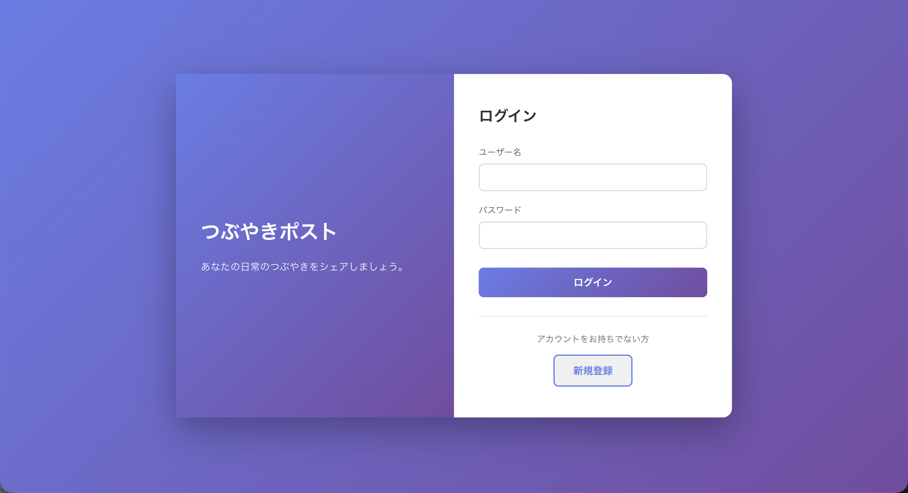
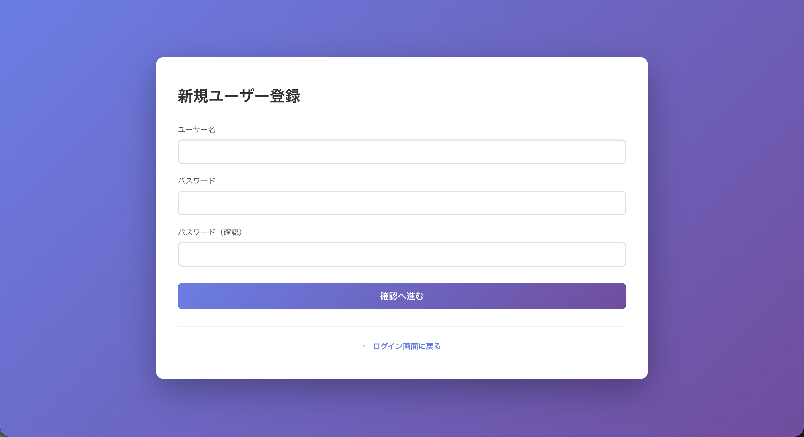
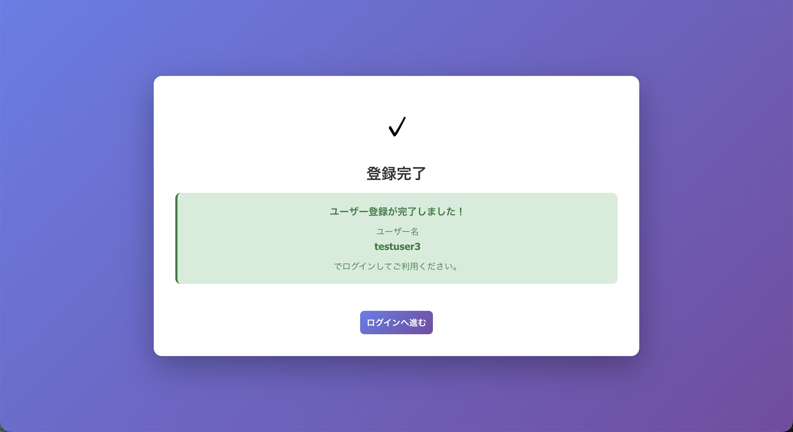
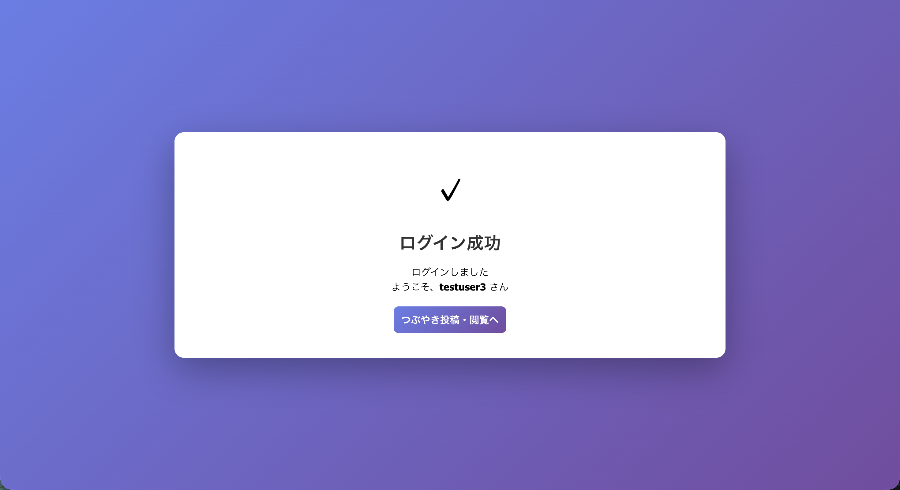
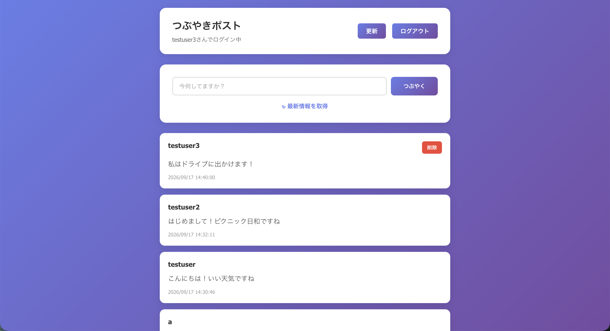

# Tsubuyaki-Post

Javaの基礎学習の成果として制作した、シンプルなつぶやき投稿Webアプリケーションです。

[公開アプリを開く](https://tsubuyaki-post.onrender.com) ｜ [GitHubリポジトリ](https://github.com/akiyosi1227/Tsubuyaki-Post)

> Renderの無料プランを利用しているため、初回アクセス時は起動まで1分程度かかる場合があります。

## アプリ概要

ユーザー登録後にログインし、短いメッセージを投稿できるWebアプリです。投稿はPostgreSQLへ保存され、新しいものから一覧表示されます。ログインユーザーは自分の投稿だけを削除できます。

「ユーザーが入力した内容をJavaで受け取り、データベースへ保存して画面に表示する」というWebアプリの一連の流れを理解することを目標に制作しました。学習を進めながら、ユーザー登録、ログイン、投稿、削除、データベース接続、Web上への公開まで段階的に実装しています。

## この作品で取り組んだこと

JavaのWebアプリケーションを制作する中で、画面を作るだけでなく、入力されたデータがどのように処理・保存されるのかを意識して取り組みました。

- 入力内容を受け取り、処理結果に応じて画面を切り替える
- ユーザー登録、ログイン、ログアウトを実装する
- ログイン中のユーザー情報を保持する（セッション管理）
- 画面、処理、データベース操作でJavaクラスの役割を分ける
- JavaからPostgreSQLへ接続し、ユーザーや投稿を保存する
- 投稿を新しい順に表示し、自分の投稿だけ削除できるようにする
- 開発途中でデータベースをH2 DatabaseからPostgreSQLへ変更する
- ローカルで作ったアプリをDockerとRenderを使ってWeb上に公開する

### 生成AIの利用について

本プロジェクトではJavaの機能実装とデータベース連携の学習に時間を使うため、HTML / CSSの配色やレイアウト案の作成に生成AIを活用しました。提案されたコードは画面表示を確認し、必要な部分を調整して使用しています。

別途制作したRubyのポートフォリオでは、画面デザインを含めて一から実装しています。この作品では、生成AIを利用した部分と自分が重点的に学習・実装した部分を明確にしています。

## 画面イメージ

アプリを起動しなくても主要機能を確認できるよう、実際の操作画面を掲載しています。

### ログイン

登録済みのユーザー名とパスワードを使ってログインします。



### ユーザー登録

ユーザー名、パスワード、確認用パスワードを入力し、確認処理を経て登録します。



### 登録完了

登録処理が成功すると、登録したユーザー名を表示してログイン画面へ案内します。



### ログイン成功

認証に成功するとログインユーザー名を表示し、投稿一覧へ遷移できます。



### 投稿・一覧表示・削除

つぶやきの投稿と新しい順での一覧表示に対応しています。ログインユーザー本人の投稿にだけ削除ボタンを表示します。



## 主な機能

- ユーザーの新規登録
- ログイン / ログアウト
- ログイン状態の保持
- つぶやきの投稿
- つぶやきの一覧表示（新しい順）
- 自分の投稿の削除
- PostgreSQLへのユーザー情報・投稿データの保存
- ユーザー名の重複、未入力、文字数、パスワード一致の確認
- パスワードを元の文字列へ戻せない形に変換して保存

## 使用した技術・サービス

本アプリで使用している技術と、それぞれの役割をまとめています。

| 項目               | 使用技術            | この作品での役割                   |
| ------------------ | ------------------- | ---------------------------------- |
| プログラミング言語 | Java 21             | 登録、ログイン、投稿などの処理     |
| 画面               | JSP / HTML / CSS    | 入力フォームや投稿一覧の表示       |
| Webの処理          | Jakarta Servlet 6.0 | 入力の受け取りと画面遷移           |
| Webサーバー        | Apache Tomcat 10.1  | Javaアプリの実行                   |
| データベース       | PostgreSQL          | ユーザー情報と投稿の保存           |
| DB接続             | JDBC                | JavaとPostgreSQLの接続             |
| パスワード保護     | BCrypt              | パスワードを変換して保存・照合     |
| ビルド             | Maven               | 必要なライブラリの管理とWAR作成    |
| 実行環境           | Docker              | 同じ環境でアプリを動かすための設定 |
| 公開環境           | Render              | WebアプリとPostgreSQLの公開        |
| 開発環境           | Eclipse             | Javaコードの作成・実行             |
| ソース管理         | Git / GitHub        | 変更履歴とソースコードの管理       |

## システム構成

ブラウザから送信された内容をJavaで処理し、必要に応じてPostgreSQLへ保存します。以下は、その流れを簡略化した図です。

```text
ブラウザ
   ↓ HTTPS
Render Web Service
   ↓
Docker
   ↓
Apache Tomcat 10.1
   ↓
JSP / Servlet
   ↓
Logic
   ↓
DAO
   ↓ JDBC
Render PostgreSQL
```

アプリケーション内部では、画面表示、リクエスト処理、業務処理、データアクセスの役割を分けています。

```text
Tsubuyaki-Post/
├── src/main/
│   ├── java/
│   │   ├── servlet/          # リクエスト処理・画面遷移
│   │   ├── logic/            # アプリケーションロジック
│   │   ├── dao/              # データベース操作
│   │   └── model/            # データモデル
│   ├── resources/            # ローカル用DB設定
│   └── webapp/               # JSP・CSS・WEB-INF
├── images/                   # README用画面画像
├── Dockerfile                # Renderで利用するコンテナ定義
├── pom.xml                   # Mavenビルド・依存関係設定
├── schema.sql                # PostgreSQL初期化SQL
├── DATABASE_SCHEMA.md        # DB設計書
├── POSTGRESQL_SETUP.md       # PostgreSQLセットアップ手順
└── MIGRATION_COMPLETE.md     # PostgreSQL移行内容
```

## データベース設計

### `users`テーブル

| カラム       | 型             | 制約・用途                 |
| ------------ | -------------- | -------------------------- |
| `id`         | `SERIAL`       | 主キー、自動採番           |
| `name`       | `VARCHAR(100)` | 必須、一意のユーザー名     |
| `pass`       | `VARCHAR(255)` | 必須、BCryptハッシュを保存 |
| `created_at` | `TIMESTAMP`    | 作成日時                   |
| `updated_at` | `TIMESTAMP`    | 更新日時                   |

### `mutters`テーブル

| カラム       | 型             | 制約・用途       |
| ------------ | -------------- | ---------------- |
| `id`         | `SERIAL`       | 主キー、自動採番 |
| `name`       | `VARCHAR(100)` | 必須、投稿者名   |
| `text`       | `TEXT`         | 必須、投稿内容   |
| `created_at` | `TIMESTAMP`    | 投稿日時         |

現在は`mutters.name`に投稿者名を保持し、`users`テーブルとの外部キーは設定していません。今後は`mutters`へ`user_id`を追加し、`users.id`を参照する設計に変更することでデータの整合性を高める予定です。

## ローカル環境でのセットアップ（開発者向け）

### 必要な環境

- JDK 21以降
- Maven 3.9以降
- Apache Tomcat 10
- PostgreSQL
- Git

### 1. リポジトリを取得

```bash
git clone https://github.com/akiyosi1227/Tsubuyaki-Post.git
cd Tsubuyaki-Post
```

### 2. データベースを作成

```bash
psql -U postgres -h localhost -c "CREATE DATABASE tsubuyaki_post;"
psql -U postgres -h localhost -d tsubuyaki_post -f schema.sql
```

### 3. ローカル用DB接続情報を設定

`src/main/resources/db.properties`を作成し、使用環境に合わせて設定します。

```properties
db.driver=org.postgresql.Driver
db.url=jdbc:postgresql://localhost:5432/tsubuyaki_post
db.user=postgres
db.password=your_password
```

`db.properties`はGitおよびDockerの管理対象から除外しています。実際の認証情報をコミットしないでください。

### 4. WARファイルを作成

```bash
mvn clean package
```

ビルドに成功すると、次のファイルが作成されます。

```text
target/ROOT.war
```

作成された`ROOT.war`をTomcatへ配置して起動します。

## Renderへのデプロイ

本番環境では、Mavenのマルチステージビルドで`ROOT.war`を作成し、Tomcat 10.1のDockerコンテナで実行しています。

Render Web Serviceには次の環境変数を設定します。

| 変数名        | 用途                         |
| ------------- | ---------------------------- |
| `DB_URL`      | PostgreSQLのJDBC接続URL      |
| `DB_USER`     | PostgreSQLのユーザー名       |
| `DB_PASSWORD` | PostgreSQLのパスワード       |
| `PORT`        | Tomcatの公開ポート（`8080`） |

認証情報はRenderの環境変数として管理し、GitHubやDockerイメージには含めていません。`main`ブランチへのpushを契機にRenderが自動デプロイします。

公開URL：<https://tsubuyaki-post.onrender.com>

## H2 DatabaseからPostgreSQLへの移行

開発当初は学習用のH2 Databaseを使用していました。その後、Web上へ公開してもデータを保存できる構成を学ぶため、PostgreSQLへ変更しました。

- JavaからPostgreSQLへ接続するためのライブラリと設定を追加
- ユーザーと投稿を保存するテーブルをPostgreSQL上に作成
- ユーザー名の重複を防ぐルールを設定
- 投稿を新しい順に取得できることを確認
- ローカル用と公開環境用で接続情報を切り替えられるように変更
- 公開環境のパスワードをソースコードへ書かない構成へ変更

## 安全性のために対応したこと

学習段階のアプリですが、公開する上で必要だと考えた対策を調べ、次の内容を実装しました。

- パスワードは元の文字列を保存せず、BCryptで変換して保存
- SQLへ入力値を直接つなげず、`PreparedStatement`を使用
- ログインしている本人の投稿だけに削除ボタンを表示
- 削除処理でも投稿者名を確認し、他人の投稿削除を防止
- 未入力、文字数、パスワード確認、ユーザー名重複をチェック
- DBの接続情報やパスワードをGitHubへ登録しない設定
- 公開環境の接続情報はRenderの環境変数で管理
- DB情報を画面へ表示していた開発用機能を公開前に削除

### 今後学習しながら対応したいこと

- 画面へ文字を表示するときの処理を見直し、不正なスクリプトの実行を防ぐ
- ログイン状態を保持する時間やCookieの設定を見直す
- 登録・ログイン・削除処理が正しく動くか確認するテストを追加する

## 今後の改善

現在の知識を復習しながら、次の機能を一つずつ追加したいと考えています。

- 投稿内容をあとから編集できる機能
- 投稿が増えたときにページを分けて表示する機能
- ユーザー名や投稿内容を使った簡単な検索機能
- スマートフォンでも見やすい画面への調整
- エラーが起きたときに、原因が分かりやすいメッセージを表示
- ユーザーと投稿をユーザーIDで関連付けるDB設計への変更
- 登録・ログイン・投稿・削除処理の基本的なテスト

## 学習したこと

- 入力フォームの内容をJavaで受け取る方法
- 処理結果に応じて表示する画面を切り替える方法
- ログインしているユーザーの情報を保持する方法
- 画面処理、アプリの処理、DB操作でクラスの役割を分ける考え方
- JavaからSQLを実行し、データを登録・取得・削除する方法
- パスワードをそのまま保存しないことの重要性
- PostgreSQLのテーブル作成と基本的なSQL
- 使用するデータベースを途中で変更する際に必要な作業
- Mavenを利用して必要なライブラリを管理する方法
- DockerとRenderを使ってローカルのアプリをWeb上に公開する流れ
- パスワードなどの秘密情報をソースコードへ書かない方法
- Git / GitHubを使って変更履歴を残す方法

## 関連ドキュメント

- [`DATABASE_SCHEMA.md`](DATABASE_SCHEMA.md) — データベース設計
- [`POSTGRESQL_SETUP.md`](POSTGRESQL_SETUP.md) — PostgreSQL導入・接続手順
- [`MIGRATION_COMPLETE.md`](MIGRATION_COMPLETE.md) — PostgreSQLへの移行内容
- [`schema.sql`](schema.sql) — テーブル・インデックス作成SQL

## 注意事項

- 本アプリケーションは学習目的で制作しています。
- Renderの無料Web Serviceは、一定時間アクセスがない場合に停止し、次回アクセス時の起動に時間がかかる場合があります。
- 無料のRender Postgresには利用期限があるため、公開URLが利用できない場合があります。
- テスト用アカウントは公開していません。動作確認時は新規ユーザー登録を行ってください。
